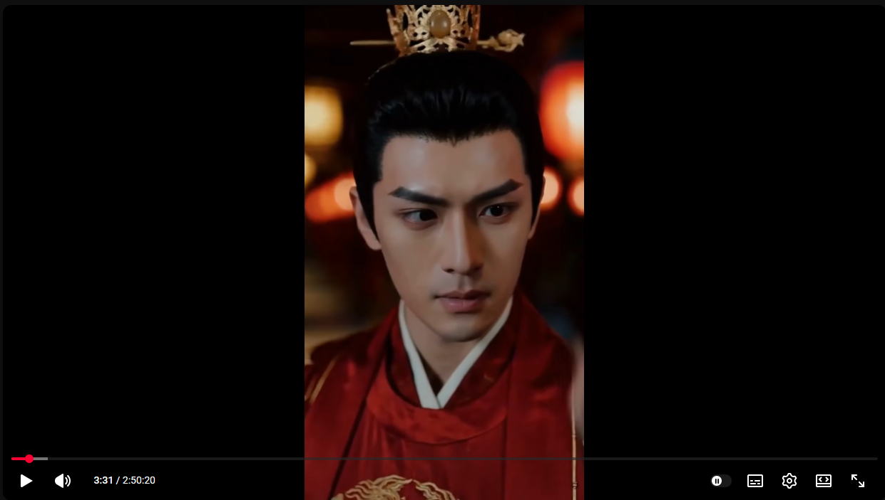
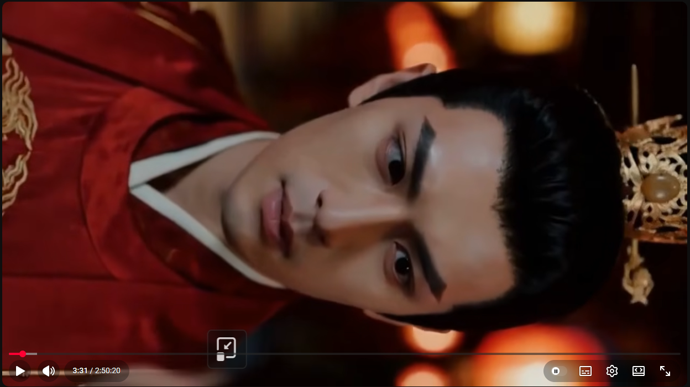
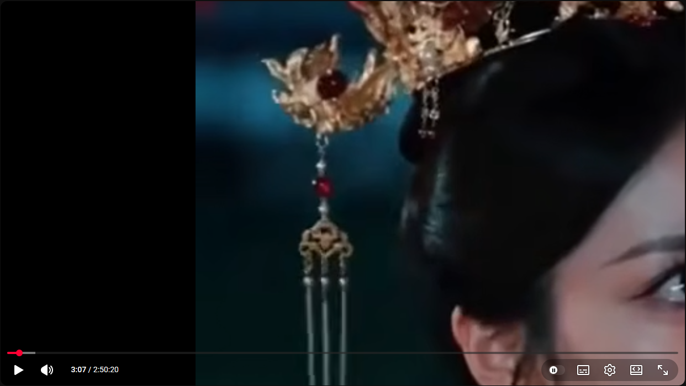

# Управление просмотром видео (AM_Video_Control)
Легковесный юзерскрипт для [TamperMonkey](http://tampermonkey.net/) и ему подобных, который добавляет продвинутое управление воспроизведением (поворот, отражение, зум и панорамирование) с помощью горячих клавиш в любой (но это не точно) веб-плеер, не захламляя интерфейс лишними кнопками.

Для экранов с возможностью поворота в книжную ориентацию (планшетов, ноутбуков, мониторов). Можно отразить видео если хочется посмотреть его вверх-ногами :) Или если хочется рассмотреть что-то на видео увеличив это на весь экран. Все трансформации происходят исключительно над самим видео внутри плеера и не меняет интерфейс плеера, его ориентацию.

[<< УСТАНОВИТЬ СКРИПТ >>](https://raw.githubusercontent.com/Angel-Metatron/AM_VideoControl/refs/heads/main/AM_VideoControl.user.js)

[Скачать последнюю версию](https://github.com/Angel-Metatron/AM_VideoControl/releases/latest)

### 🚀 Возможности:
- Поворот на 90° (клавиша R (англ) или К (русск)) по часовой стрелке с автоматической подгонкой масштаба под плеер, чтобы видео не обрезалось по краям.
- Отражение по горизонтали (клавиша H (англ) или Р (русск)), по вертикали (клавиша V (англ) или М (русск)).
- Масштаб / Свободный Зум (Alt + Колесо мыши, lt + Num+/Num-) от -10x до +10x, как в большую, так и в меньшую сторону, сброс масштаба (Alt + 0/Num0). Перемещение по увеличенному видео с помощью перетаскивания мышкой. Зажмите левую кнопку мыши на приближенном видео, чтобы свободно двигать кадр.
- Запоминание настроек при переходе из обычного режима в полноэкранный и наоборот.
- Настройка клавиш пока только правкой самого скрипта в блоке настроек. (не заморачивался)

### 👥 Кому и для чего пригодится?
- Зрителям «кривых» загрузок: Быстро развернет горизонтально записанное видео, которое ошибочно залили как вертикальное (и наоборот).
- Для обучения и работы: Позволяет приблизить мелкий текст, код на экране лектора или детали интерфейса в видеоуроках и скринкастах. С помощью Alt + Колесо можно приблизить конкретную область экрана и рассмотреть каждую цифру.
- Для спорта, танцев и хобби: Функция отражения незаменима, когда нужно зеркально повторять движения тренера или хореографа на экране.
- Любителям минимализма: Весь функционал работает через хоткеи, не внедряя в плееры уродливые сторонние кнопки и баннеры.

### 🎬 Какие видео скрипт поможет смотреть?
- Сейчас в ютубе много ИИ-видео в книжном формате с полями по бокам типа шортсов, или для шортсов открываемых через `/watch?v=id`, с этим скриптом видео можно повернуть и оно заполнит весь экран.
- Мобильный контент на ПК: ~~~YouTube Shorts, TikTok-видео, REELS или~~~ ролики, снятые на телефон, которые неудобно смотреть в стандартной горизонтальной ориентации. (В процессе)

### 🖥️ Для каких устройств и экранов он пригодится?
- Поворотные мониторы (с поддержкой Pivot)
    Если у вас есть второй (или основной) монитор, развернутый вертикально (портретный режим на 90°), этот скрипт — спасение. Вы сможете смотреть любые стандартные горизонтальные видео, просто развернув их кнопкой R под физическую ориентацию своего экрана.
- Планшеты-трансформеры и ноутбуки 2-в-1 (на Windows/macOS)
    При просмотре видео на устройствах вроде Microsoft Surface или ноутбуках-трансформерах, которые вы держите в руках как планшет. Скрипт позволяет вручную адаптировать картинку под то, как именно вы держите устройство в данный момент.
- Сверхширокоформатные мониторы (UltraWide 21:9, 32:9)
    На таких экранах при просмотре старых фильмов (формата 4:3) или стандартных видео (16:9) часто остаются огромные пустые зоны. Зум помогает идеально вписать картинку в рамки вашего монитора, обрезав лишние черные полосы сверху и снизу.
- Проекторы и домашние кинотеатры
    При проецировании на стену или нестандартные экраны. Если проектор установлен под небольшим углом или нужно скорректировать положение картинки на стене, функции сдвига (drag-and-drop) и зума позволяют идеально «подогнать» изображение под границы вашей импровизированной зоны просмотра.

#### Поворот

#### Масштаб

Первая проба написания скриптов для TemperMonkey, прошу сильно не пинать.
Автор: [Angel Metatron](https://github.com/Angel-Metatron)

---
AM_Video_Control - Rotation, reflection, video scale in Youtube video player and others.
